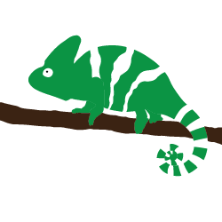

<p align="center">
  
</p>

<h1 align="center">Curtail</h1>

<p align="center">Curtail is a pure JavaScript image manipulation tool.<p>

<div align="center">
  <a href="https://badge.fury.io/js/curtail"></a>
  <a href="https://badge.fury.io/js/curtail"></a>
  <a href="https://badge.fury.io/js/curtail"></a>
  <a href="https://badge.fury.io/js/curtail"></a>
</div>


**Note:** Curtail is still in its early stages and as such has limited functionality. Make sure to check back every now and again for exciting new features!

## **Installation**

To download this module through npm, simply use the following command.

```
$ npm install --save curtail
```

Curtail doesn't have a named export so to use it as an ES6 module use the following import:

```js
import * as curtail from './node_modules/curtail/curtail.js';
```

or reference the script from the dist folder:

```html
<script src="./node_modules/curtail/dist/curtail.min.js">
```

## **API**

**Note:** As loading of images is an asynchoronous action, all of Curtail's methods return a Promise which you can use either `then` or `await` as shown in the examples below.

### **crop**

The crop method takes the path to an image, a crop start location, and the final dimensons of the image and returns the newly cropped version of the original image.

| param                | type    | description                                                                        | default |
|----------------------|---------|------------------------------------------------------------------------------------|---------|
| path                 | string  | The path to the image to crop                                                      |         |
| x                    | number  | The horizontal starting location of the crop                                       |         |
| y                    | number  | The vertical starting location of the crop                                         |         |
| width                | number  | The width of the cropped image                                                     |         |
| height               | number  | The height of the cropped image                                                    |         |
| options              | Object  |                                                                                    | {}      |
| options.autoDownload | boolean | Indicates whether the image should download after the cropping is complete or not. | false   |
| options.crossOrigin  | string  | Sets the cross-origin property of images originating from external sources.        | null    |

Using `Promise.then`:

```js
// This will take an image and start cropping at (100, 100) and create a new image
// with a width of 720x480.
curtail.crop('./path/to/image.png', 100, 100, 720, 480).then((newImage) => {

  // newImage will be your newly cropped image and if autoDownload is set to true
  // then you will have a local copy downloaded at this time.

});

```

Using `async/await`:

```js
async function main() {

  // This will take an image and start cropping at (100, 100) and create a new image
  // with a width of 720x480.
  // You should probably use `try, catch`
  const newImage = curtail.crop('./path/to/image.png', 100, 100, 720, 480).catch((err) => console.log(err));

  // newImage will be your newly cropped image and if autoDownload is set to true
  // then you will have a local copy downloaded at this time.

}

main();
```

### **convert**

The convert method takes an image and converts it from one image format to another.

If you have a transparent image and convert it to a format that doesn't support transparency, the image will be placed on a white background.

| param                | type    | description                                                                        | default |
|----------------------|---------|------------------------------------------------------------------------------------|---------|
| path                 | string  | The path to the image to crop                                                      |         |
| format               | string  | The new format for the image                                                       |         |
| options              | Object  |                                                                                    | {}      |
| options.autoDownload | boolean | Indicates whether the image should download after the cropping is complete or not. | false   |
| options.crossOrigin  | string  | Sets the cross-origin property of images originating from external sources.        | null    |

Using `Promise.then`:

```js
// This will take an image and start cropping at (100, 100) and create a new image
// with a width of 720x480.
curtail.convert('./path/to/image.png', 'jpg').then((newImage) => {

  // newImage will be your newly converted image and if autoDownload is set to true
  // then you will have a local copy downloaded at this time.

});

```

Using `async/await`:

```js
async function main() {

  // This will take an image and start cropping at (100, 100) and create a new image
  // with a width of 720x480.
  // You should probably use `try, catch`
  const newImage = curtail.convert('./path/to/image.png', 'jpg').catch((err) => console.log(err));

  // newImage will be your newly converted image and if autoDownload is set to true
  // then you will have a local copy downloaded at this time.

}

main();
```

### **resize**

The resize method takes an image and resizes it, maintaining its aspect ratio by default.

| param                       | type    | description                                                                                                                                   | default |
|-----------------------------|---------|-----------------------------------------------------------------------------------------------------------------------------------------------|---------|
| path                        | string  | The path to the image to crop                                                                                                                 |         |
| format                      | string  | Which dimension to resize, either width or height. Keep in mind that if you're preserving the aspect ratio, the other will resize accordingly |         |
| size                        | number  | The new size to make the specified dimension                                                                                                  |         |
| options                     | Object  |                                                                                                                                               | {}      |
| options.preserveAspectRatio | boolean | Indicates whether the width and height will resize together to preserve the aspect ratio of the image                                         | true    |
| options.autoDownload        | boolean | Indicates whether the image should download after the cropping is complete or not.                                                            | false   |
| options.crossOrigin         | string  | Sets the cross-origin property of images originating from external sources.                                                                   | null    |

Using `Promise.then`:

```js
// This will take an image (sized 1920x0180 in this example) and resize the width to
// be 400 which will result in the image having a width of 400 and height of 225.
curtail.resize('./path/to/image.png', 'width', 400).then((newImage) => {

  // newImage will be your newly resized image and if autoDownload is set to true
  // then you will have a local copy downloaded at this time.

});

```

Using `async/await`:

```js
async function main() {

  // This will take an image (sized 1920x0180 in this example) and resize the width to
  // be 400 which will result in the image having a width of 400 and height of 225.
  // You should probably use `try, catch`
  const newImage = curtail.resize('./path/to/image.png', 'width', 400).catch((err) => console.log(err));

  // newImage will be your newly resized image and if autoDownload is set to true
  // then you will have a local copy downloaded at this time.

}

main();
```

### **pad**

The pad method takes an image and adds the specified amount of padding to it.

| param                | type    | description                                                                                              | default       |
|----------------------|---------|----------------------------------------------------------------------------------------------------------|---------------|
| path                 | string  | The path to the image to crop                                                                            |               |
| padding              | number  | The amount of padding to add to the image                                                                |               |
| options              | Object  |                                                                                                          | {}            |
| options.paddingColor | string  | The color that the padding will be. This value can be any valid CSS color value such as white or #FFFFFF | 'transparent' |
| options.autoDownload | boolean | Indicates whether the image should download after the cropping is complete or not.                       | false         |
| options.crossOrigin  | string  | Sets the cross-origin property of images originating from external sources.                              | null          |

Using `Promise.then`:

```js
// This will take an image and add 20px of blue padding to all sides.
curtail.pad('./path/to/image.png', 20, { paddingColor: 'blue' }).then((newImage) => {

  // newImage will be your newly padded image and if autoDownload is set to true
  // then you will have a local copy downloaded at this time.

});

```

Using `async/await`:

```js
async function main() {

  // This will take an image and add 20px of blue padding to all sides.
  // You should probably use `try, catch`
  const newImage = curtail.pad('./path/to/image.png', 20, { paddingColor: 'blue' }).catch((err) => console.log(err));

  // newImage will be your newly padded image and if autoDownload is set to true
  // then you will have a local copy downloaded at this time.

}

main();
```

## **License**

MIT